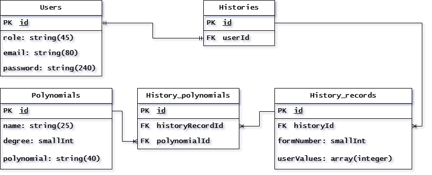

# Graduate project

A web application for generating pseudo-random sequences using vector and matrix generators, studying their properties and tools for their analysis.

## Pages

- **Main page:** Contains basic information about the application, its features, frequently asked questions and answers, and instructions for using generators.
- **Linear feedback shift register (LFSR):** Contains an implementation of a linear feedback shift register and additional components for analyzing generation results.
- **Matrix shift register (MSR):** Contains an implementation of a matrix shift register and additional components for analyzing generation results.
- **Sum and product:** Contains an implementation of a generator that is based on two linear registers, which creates new sequences by performing bit operations (sum and product) on pseudo-random sequences that are generated by these vector generators.
- **Frobenius:**  Contains a generator that is based on a matrix register but uses Frobenius normal form as an initial state to generate pseudo-random sequences.
- **Comparison:**  Allows you to compare linear and matrix register on the same page with additional analysis tools.
- **Polynomials:**  Contains an interactive table, available only to authorized users, with all the polynomials used for generation, their degrees and bit form.

## Features

- **Polynomial table:** Check out the large table that gives the complete list of irreducible polynomials over the field GF(2).
- **Correlation graphs:** Explore the correlation of generated sequences using correlation graphs.
- **Data storage:** Easily store and manage your query history and sequence generation data.
- **Comparison of characteristics:** Compare the characteristics and properties of matrix and linear generators right next to each other.
- **Speed:** Thanks to many optimization solutions at different levels, freezes and lags are kept to a minimum.
- **Convenient data transfer:** By saving parameters in the query string, users can easily share their data with other users by simply sending a link.
- **A single platform:** A wide range of useful pages and tools for research and sequence generation in one platform.
- **Variety of polynomials:** A wide selection of polynomials up to the 15th degree that can be used in the generation.
- **User-friendly interface:** Convenient and attractive interface that even beginners can easily master.

## Technologies Used

### Frontend
- **React**: JavaScript library for building user interfaces.
- **React-Plotly**: A charting library for React applications.
- **Headless UI**: A set of unstyled accessible UI components.
- **MobX**: State management library.
- **React-Router-Dom**: Handling routing in the React application.
- **TailwindCSS**: Utility-first CSS framework.
- **TypeScript**: Superset of JavaScript that adds static types.
- **React-window**: A library for rendering large lists and tabular data efficiently.
- **Axios**: Promise-based HTTP client for making requests to APIs.

### Backend
- **Node.js**: JavaScript runtime environment.
- **Express**: Web framework for Node.js.
- **Sequelize**: An ORM (Object-Relational Mapping) for interacting with databases.
- **PostgreSQL**: Open-source relational database management system.
- **JWT (JSON Web Tokens)**: Authentication mechanism for securing API endpoints.
- **Nodemon**: Utility for automatically restarting the server during development.
- **Bcrypt**: Library for hashing passwords.
- **TypeScript**: Superset of JavaScript that adds static types.
- **Cors**: Package for enabling Cross-Origin Resource Sharing.
- **Dotenv**: Loads environment variables from a .env file.
- **Pg**: PostgreSQL client for Node.js.
- **Pg-hstore**: A node package for serializing and deserializing JSON data to hstore format in PostgreSQL.

### Database
- **PostgreSQL**: Open-source relational database.
- **Database Schema**
 

### Build tool
- **Vite**: A build tool that provides a faster development experience.

### IDE
- **WebStorm**: An Integrated Development Environment (IDE) for modern JavaScript development.

## Installation

To run the Application locally:

1. Clone the repository: 
```shell
git clone https://github.com/Makudzyn/graduate-project.git
```
2. Navigate to the project directory: 
```shell
cd graduate-project
```
3. Install dependencies for both client and server parts: 
```shell
npm install
```
4. Start the client application: 
```shell
cd client 
npm run dev
```
5. Start the server application: 
```shell
cd ../server
npm run dev
```

## Usage

After installing and running the application, follow these steps:

Open your web browser and navigate to http://localhost:5173/main.
On the main page, read the provided information and tips to familiarize yourself with the application.
Refer to the User Manual section for detailed instructions on how to use the application's features and generators.

## Contributing

Contributions to the project are welcome! If you'd like to contribute, please fork the repository and create a pull request.

## License

This project is licensed under the MIT License. See the [LICENSE](./LICENSE) file for details.
