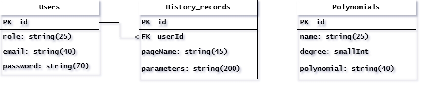

# Graduate project

An application for generating pseudo-random sequences created by a linear and matrix generator. Study of their properties and dependencies, comparison, and analysis.

## Overview

The application is designed to demonstrate the functionality of linear and matrix feedback shift registers, their properties, and analyze correlation coefficients by visualizing the generated data using a charting library in a user-friendly interface.

## Features

- **Linear and Matrix Generator:** Generate pseudo-random sequences using linear and matrix feedback shift registers.
- **Correlation Coefficient Analysis:** Analyze and visualize correlation coefficients for the generated data.
- **Zoom Functionality:** Allows users to zoom in for a more detailed view of the data visualization.
- **Interactive Charts:** Utilizes a charting library with interactive features and tooltips for better understanding.
- **User Interface:** A user-friendly interface for ease of use.

## Technologies Used

### Frontend
- **React**: JavaScript library for building user interfaces.
- **Recharts**: A charting library for React applications.
- **Headless UI**: A set of unstyled accessible UI components.
- **MobX**: State management library.
- **React-Router-Dom**: Handling routing in the React application.
- **TailwindCSS**: Utility-first CSS framework.
- **TypeScript**: Superset of JavaScript that adds static types.
- **Vite**: A build tool that provides a faster development experience.

### Backend
- **Node.js**: JavaScript runtime environment.
- **Express**: Web framework for Node.js.
- **Sequelize**: An ORM (Object-Relational Mapping) for interacting with databases.
- **PostgreSQL**: Open-source relational database management system.
- **JWT (JSON Web Tokens)**: Authentication mechanism for securing API endpoints.
- **Nodemon**: Utility for automatically restarting the server during development.
- **bcrypt**: Library for hashing passwords.
- **cors**: Package for enabling Cross-Origin Resource Sharing.
- **dotenv**: Loads environment variables from a .env file.
- **pg**: PostgreSQL client for Node.js.
- **pg-hstore**: A node package for serializing and deserializing JSON data to hstore format in PostgreSQL.

### Database
- **PostgreSQL**: Open-source relational database.
- **Database Schema**
 

### IDE
- **WebStorm**: An Integrated Development Environment (IDE) for modern JavaScript development.

## Installation

To run the Linear Generator Application locally:

1. Clone the repository.
2. Navigate to the project directory.
3. Install dependencies: `npm install`.
4. Start the development server: `npm start`.

## Usage

After installing and running the application, follow the on-screen instructions.

## Contributing

Contributions to the project are welcome! If you'd like to contribute, please fork the repository and create a pull request.

## License

This project is licensed under the MIT License. See the [LICENSE](./LICENSE) file for details.
